# (3b) 1. Create a view named EMP_VIEW that displays all columns from the EMPLOYEE table.

```
CREATE VIEW EMP_VIEW AS
SELECT *
FROM EMPLOYEE;
```
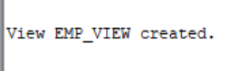

# (3b) 2. Create a view named EMP_BASIC that displays Employee ID, First Name, Last Name, Department, and Salary.

```
CREATE VIEW EMP_BASIC AS
SELECT employee_id, first_name, last_name, department, salary
FROM EMPLOYEE;
```
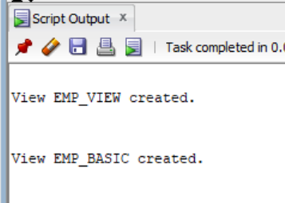

# (3b) 3. Display all records from the EMP_VIEW.

```
SELECT *
FROM EMP_VIEW;
```
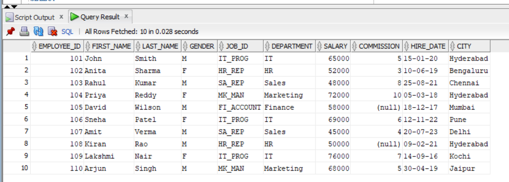

# (3b) 4. Create a view named IT_EMPLOYEES for employees working in IT department.

```
CREATE VIEW IT_EMPLOYEES AS
SELECT *
FROM EMPLOYEE
WHERE department = 'IT';
```
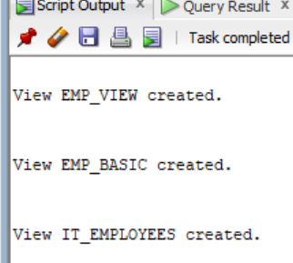

# (3b) 5. Create a view named HIGH_SALARY for employees whose salary is greater than ₹60,000.

```
CREATE VIEW HIGH_SALARY AS
SELECT *
FROM EMPLOYEE
WHERE salary > 60000;
```
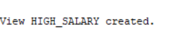

# (3b) 6. Create a view named HYDERABAD_EMP for employees whose city is Hyderabad.

```
CREATE VIEW HYDERABAD_EMP AS
SELECT *
FROM EMPLOYEE
WHERE city = 'Hyderabad';
```
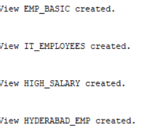

# (3b) 7. Create a view named FEMALE_EMP for all female employees.

```
CREATE VIEW FEMALE_EMP AS
SELECT *
FROM EMPLOYEE
WHERE gender = 'F';
```
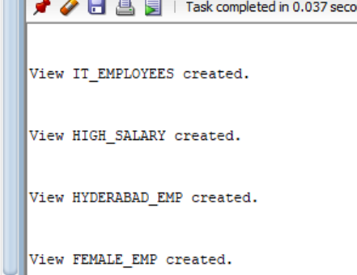

# (3b) 8. Create a view named RECENT_EMPLOYEES for employees hired on or after 01-JAN-2020.

```
CREATE VIEW RECENT_EMPLOYEES AS
SELECT *
FROM EMPLOYEE
WHERE hire_date >= TO_DATE('01-JAN-2020', 'DD-MON-YYYY');
```
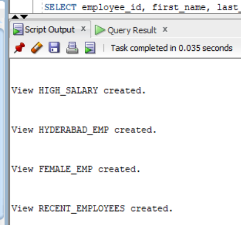

# (3b) 9. Display Employee ID, First Name, and Salary from HIGH_SALARY.

```
SELECT employee_id, first_name, salary
FROM HIGH_SALARY;
```
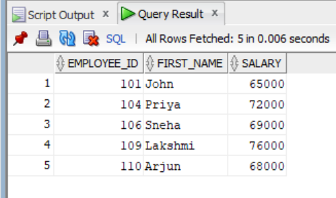

# (3b) 10. Replace EMP_BASIC view by adding CITY column.

```
CREATE OR REPLACE VIEW EMP_BASIC AS
SELECT employee_id, first_name, last_name, department, salary, city
FROM EMPLOYEE;
```
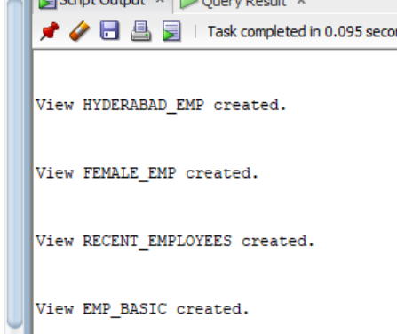

# (3b) 11. Create a read-only view named EMP_SALARY_VIEW.

```
CREATE VIEW EMP_SALARY_VIEW AS
SELECT employee_id, first_name, last_name, salary
FROM EMPLOYEE
WITH READ ONLY;
```
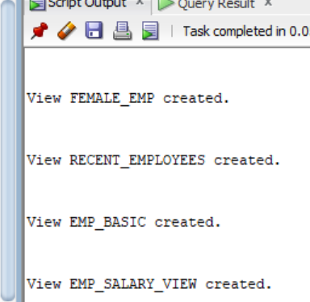

# (3b) 12. Create SALES_EMP view using WITH CHECK OPTION.

```
CREATE VIEW SALES_EMP AS
SELECT *
FROM EMPLOYEE
WHERE department = 'Sales'
WITH CHECK OPTION;
```
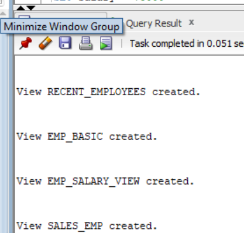

# (3b) 13. Update salary of employee 101 through EMP_BASIC view.

```
UPDATE EMP_BASIC
SET salary = 75000
WHERE employee_id = 101;
```
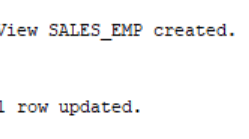

# (3b) 14. Delete employee 107 through EMP_VIEW.

```
DELETE FROM EMP_VIEW
WHERE employee_id = 107;
```
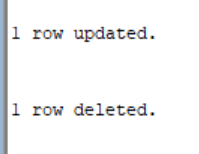

# (3b) 15. Insert a new employee into EMP_BASIC view.

```
INSERT INTO EMP_BASIC
(employee_id, first_name, last_name, department, salary)
VALUES
(111, 'Ravi', 'Kumar', 'IT', 50000);
```
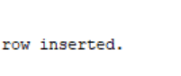

# (3b) 16. Display the structure of EMP_BASIC.

```
DESC EMP_BASIC;
```
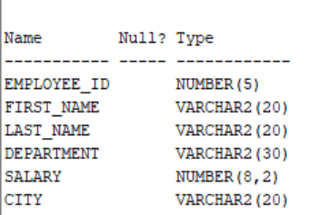

# (3b) 17. Display all records from IT_EMPLOYEES.

```
SELECT *
FROM IT_EMPLOYEES;
```
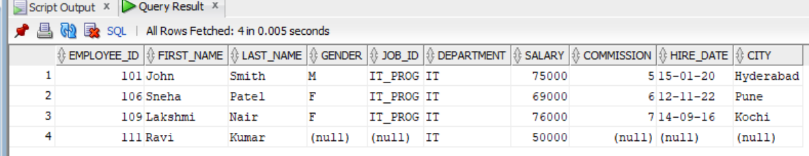

# (3b) 18. Display employees from HIGH_SALARY whose salary is greater than ₹70,000.

```
SELECT *
FROM HIGH_SALARY
WHERE salary > 70000;
```
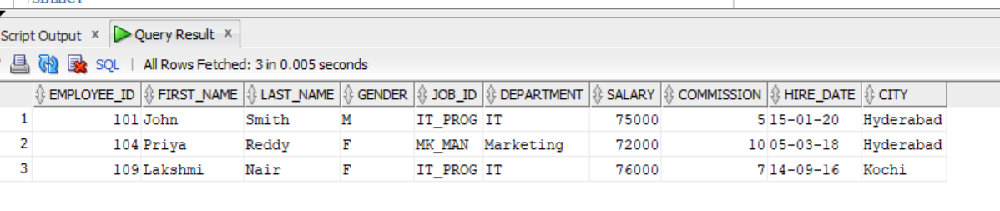

# (3b) 19. Display all female employees from FEMALE_EMP.

```
SELECT *
FROM FEMALE_EMP;
```
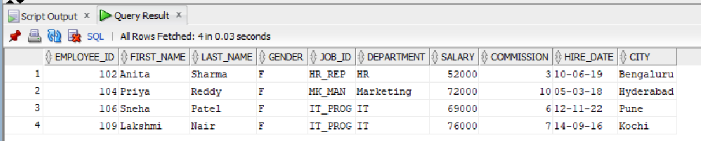

# (3b) 20. Display names and salaries of employees from HYDERABAD_EMP.

```
SELECT first_name, salary
FROM HYDERABAD_EMP;
```
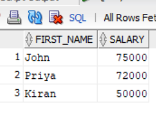

# (3b) 21. Drop EMP_VIEW.

```
DROP VIEW EMP_VIEW;
```
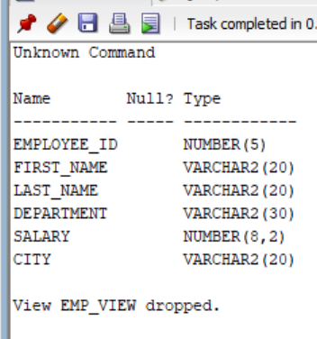

# (3b) 22. Drop HIGH_SALARY.

```
DROP VIEW HIGH_SALARY;
```
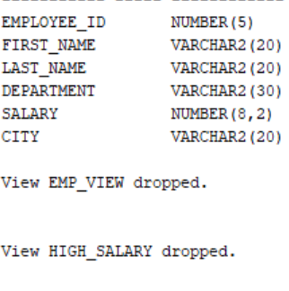

# (3b) 23. Drop EMP_BASIC.

```
DROP VIEW EMP_BASIC;
```
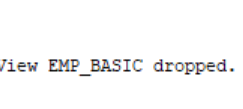

# (3b) 24. Create HR_EMPLOYEES view for HR department employees.

```
CREATE VIEW HR_EMPLOYEES AS
SELECT *
FROM EMPLOYEE
WHERE department = 'HR';
```
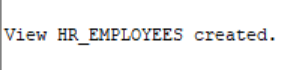

# (3b) 25. Create MARKETING_EMP view displaying Employee ID, First Name, Department and Salary.

```
CREATE VIEW MARKETING_EMP AS
SELECT employee_id, first_name, department, salary
FROM EMPLOYEE
WHERE department = 'Marketing';
```
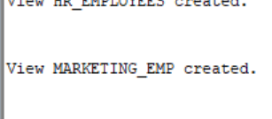

# (3b) 26. Create TOP_EARNERS view for employees earning more than ₹70,000.

```
CREATE VIEW TOP_EARNERS AS
SELECT *
FROM EMPLOYEE
WHERE salary > 70000;
```
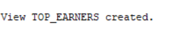

# (3b) 27. Create EMP_CITY view displaying Employee ID, First Name, Last Name and City.

```
CREATE VIEW EMP_CITY AS
SELECT employee_id, first_name, last_name, city
FROM EMPLOYEE;
```

