# (4) 1. Create DEPT table

```
CREATE TABLE DEPT
(
    DNO NUMBER,
    DNAME VARCHAR2(30)
);
```
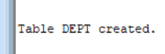

# (4) 2. Primary Key for DNO and NOT NULL for DNAME

```
ALTER TABLE DEPT
ADD CONSTRAINT PK_DEPT PRIMARY KEY (DNO);
ALTER TABLE DEPT
MODIFY DNAME NOT NULL;
```
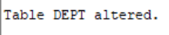

# (4) 3. Create STUDENT4 table

```
CREATE TABLE STUDENT4
(
    SID NUMBER,
    SNAME VARCHAR2(30),
    DID NUMBER
);
```


# (4) 4. Apply constraints to STUDENT4

```
ALTER TABLE STUDENT4
ADD CONSTRAINT PK_STUDENT4 PRIMARY KEY (SID);
ALTER TABLE STUDENT4
MODIFY SNAME NOT NULL;
ALTER TABLE STUDENT4
ADD CONSTRAINT FK_STUDENT4_DEPT
FOREIGN KEY (DID)
REFERENCES DEPT(DNO);
```
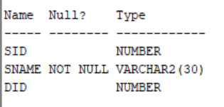

# (4) 5. Insert departments

```
INSERT INTO DEPT VALUES (10, 'CSE');
INSERT INTO DEPT VALUES (20, 'ME');
INSERT INTO DEPT VALUES (30, 'CE');
INSERT INTO DEPT VALUES (40, 'EEE');
INSERT INTO DEPT VALUES (50, 'ECE');
INSERT INTO DEPT VALUES (60, 'CSM');
INSERT INTO DEPT VALUES (70, 'CSD');
```
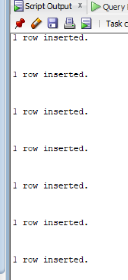

# (4) 6. Insert 10 students into STUDENT4

```
INSERT INTO STUDENT4 VALUES (101, 'Rahul', 10);
INSERT INTO STUDENT4 VALUES (102, 'Sneha', 20);
INSERT INTO STUDENT4 VALUES (103, 'Arjun', 30);
INSERT INTO STUDENT4 VALUES (104, 'Priya', 40);
INSERT INTO STUDENT4 VALUES (105, 'Kiran', 50);
INSERT INTO STUDENT4 VALUES (106, 'Nikhil', 60);
INSERT INTO STUDENT4 VALUES (107, 'Anu', 70);
INSERT INTO STUDENT4 VALUES (108, 'Ravi', 10);
INSERT INTO STUDENT4 VALUES (109, 'Meena', 20);
INSERT INTO STUDENT4 VALUES (110, 'Suresh', 30);
```
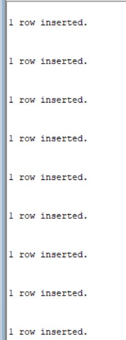

# (4) 7. NATURAL JOIN

```
SELECT S.SID, S.SNAME, S.DID, D.DNAME
FROM STUDENT4 S
JOIN DEPT D
ON S.DID = D.DNO;
```
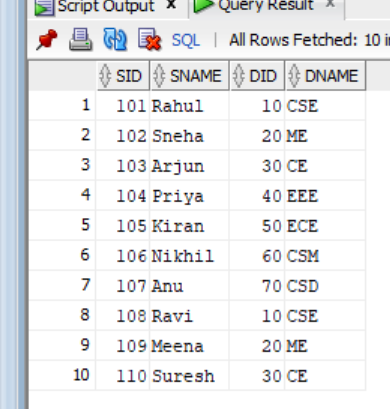

# (4) 8. EQUI JOIN

```
SELECT S.SID, S.SNAME, D.DNO, D.DNAME
FROM STUDENT4 S
INNER JOIN DEPT D
ON S.DID = D.DNO;
```
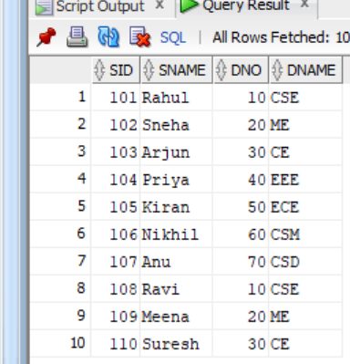

# (4) 9. CONDITIONAL JOIN

```
SELECT S.SID, S.SNAME, D.DNO, D.DNAME
FROM STUDENT4 S
JOIN DEPT D
ON S.DID > D.DNO;
```
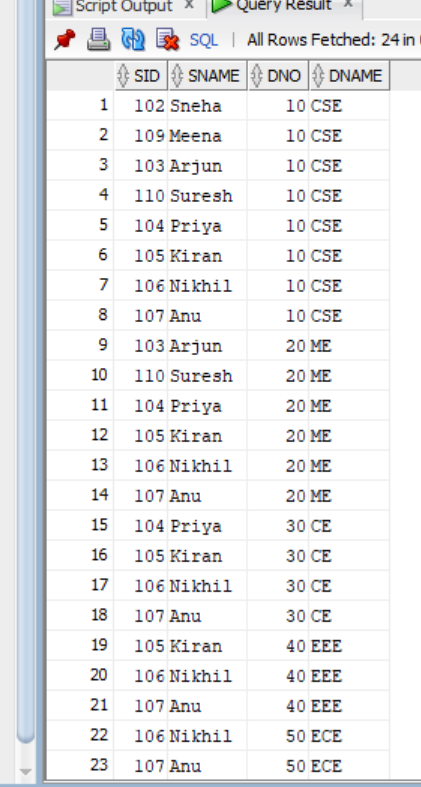
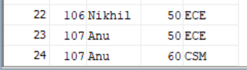
# (4) 10. LEFT OUTER NATURAL JOIN

```
SELECT S.SID, S.SNAME, S.DID, D.DNAME
FROM STUDENT4 S
LEFT OUTER JOIN DEPT D
ON S.DID = D.DNO;
```
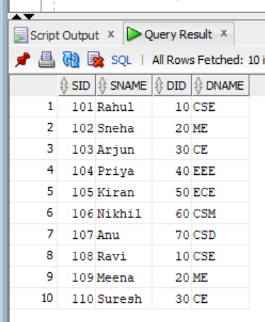

# (4) 11. RIGHT OUTER NATURAL JOIN

```
SELECT S.SID, S.SNAME, S.DID, D.DNAME
FROM STUDENT4 S
RIGHT OUTER JOIN DEPT D
ON S.DID = D.DNO;
```
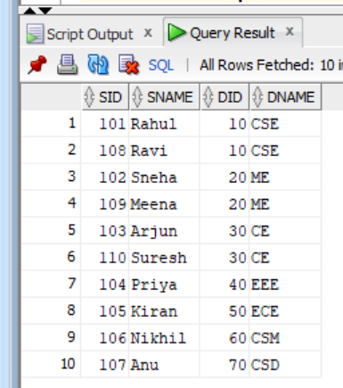

# (4) 12. FULL OUTER NATURAL JOIN

```
SELECT S.SID, S.SNAME, S.DID, D.DNAME
FROM STUDENT4 S
FULL OUTER JOIN DEPT D
ON S.DID = D.DNO;
```
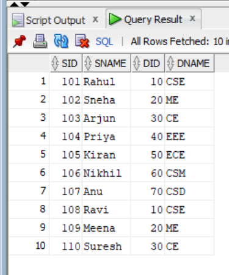

# (4) 13. LEFT OUTER EQUI JOIN

```
SELECT S.SID, S.SNAME, S.DID, D.DNO, D.DNAME
FROM STUDENT4 S
LEFT OUTER JOIN DEPT D
ON S.DID = D.DNO;
```
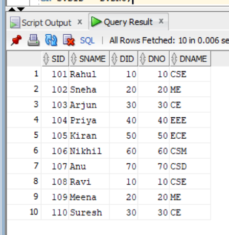

# (4) 14. RIGHT OUTER EQUI JOIN

```
SELECT S.SID, S.SNAME, S.DID, D.DNO, D.DNAME
FROM STUDENT4 S
RIGHT OUTER JOIN DEPT D
ON S.DID = D.DNO;
```
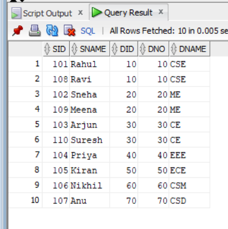

# (4) 15. FULL OUTER EQUI JOIN

```
SELECT S.SID, S.SNAME, S.DID, D.DNO, D.DNAME
FROM STUDENT4 S
FULL OUTER JOIN DEPT D
ON S.DID = D.DNO;
```
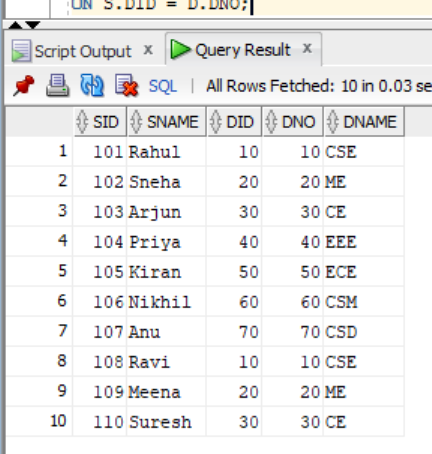

# (4) 16. LEFT OUTER CONDITIONAL JOIN

```
SELECT S.SID, S.SNAME, S.DID, D.DNO, D.DNAME
FROM STUDENT4 S
LEFT OUTER JOIN DEPT D
ON S.DID > D.DNO;
```
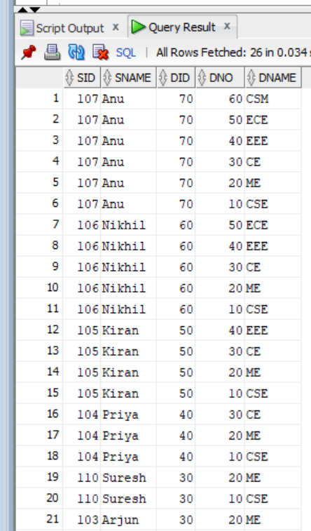
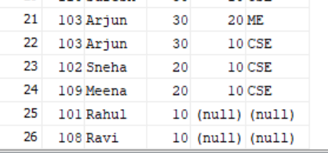

# (4) 17. RIGHT OUTER CONDITIONAL JOIN

```
SELECT S.SID, S.SNAME, S.DID, D.DNO, D.DNAME
FROM STUDENT4 S
RIGHT OUTER JOIN DEPT D
ON S.DID > D.DNO;
```
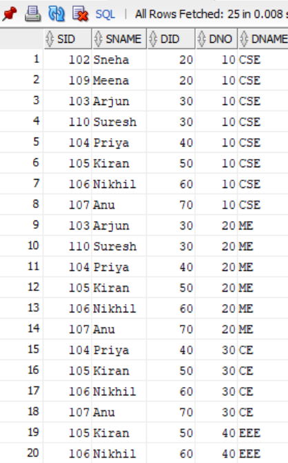
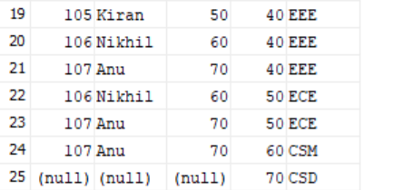

# (4) 18. FULL OUTER CONDITIONAL JOIN

```
SELECT S.SID, S.SNAME, S.DID, D.DNO, D.DNAME
FROM STUDENT4 S
FULL OUTER JOIN DEPT D
ON S.DID > D.DNO;
```
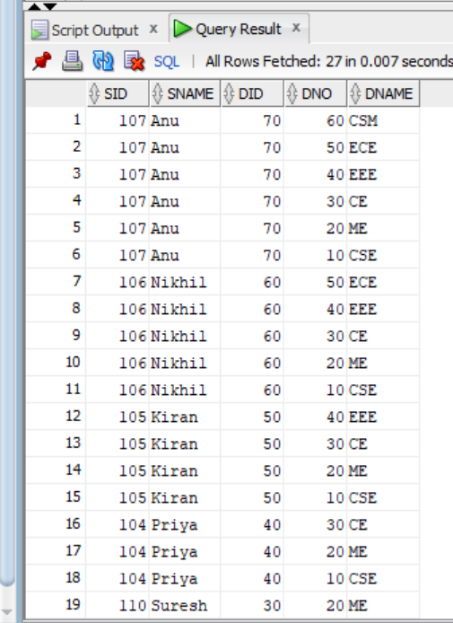
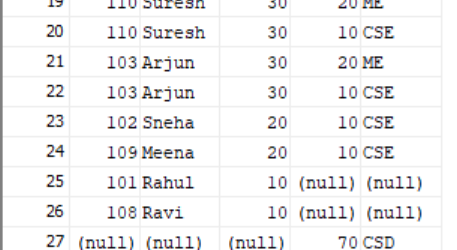

# (4) 19. CROSS JOIN

```
SELECT S.SID, S.SNAME, D.DNO, D.DNAME
FROM STUDENT4 S
CROSS JOIN DEPT D;
```
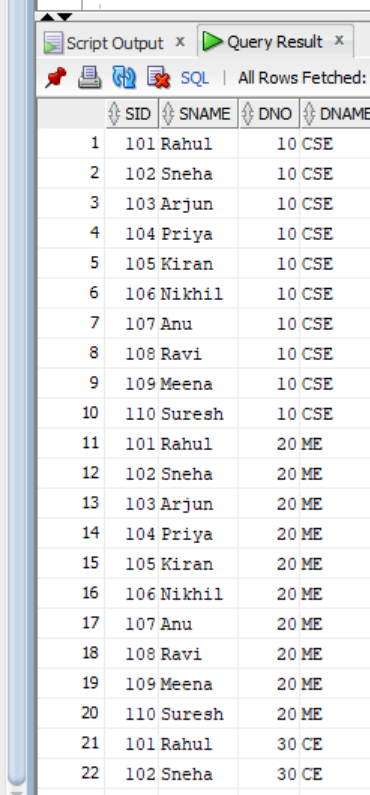
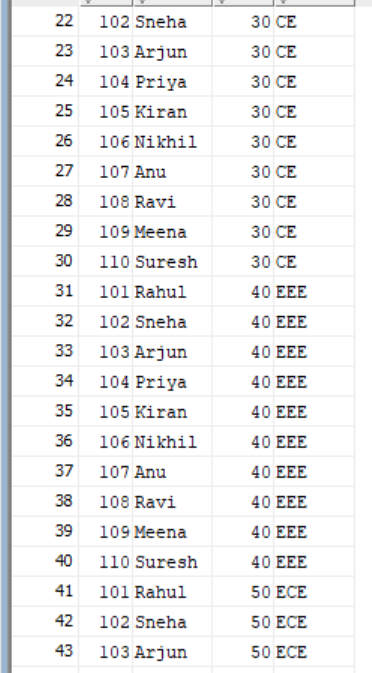
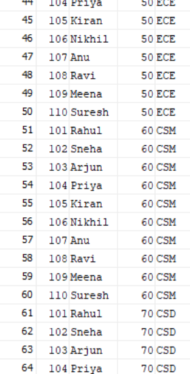
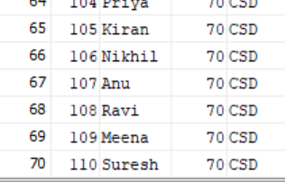

# (4) 21. Practice JOIN operations

```
SELECT S.SID, S.SNAME, D.DNAME
FROM STUDENT4 S
INNER JOIN DEPT D;
```
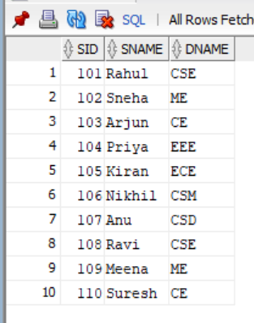
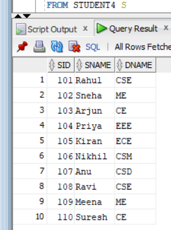
